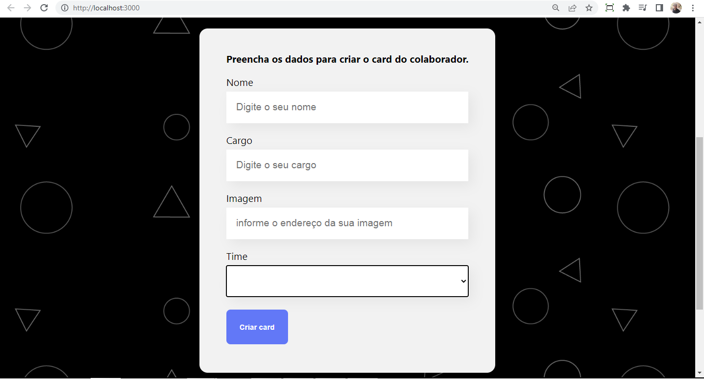

<h1 align="center">
 
  
 
 
<a href="https://organograma-mzz62aibu-hismaille.vercel.app/">https://organograma-mzz62aibu-hismaille.vercel.app/</a>
 
Organograma para desenvolvedores de games.
</h1>

Primeiro Projeto feito React Js, um organograma simples segindo os passos do curso da Alura. Teve modificações pessoais para dar uma cara nova para projeto, feita da minha maneira.

[//]: # (Add your gifs/images here:)

  
  

